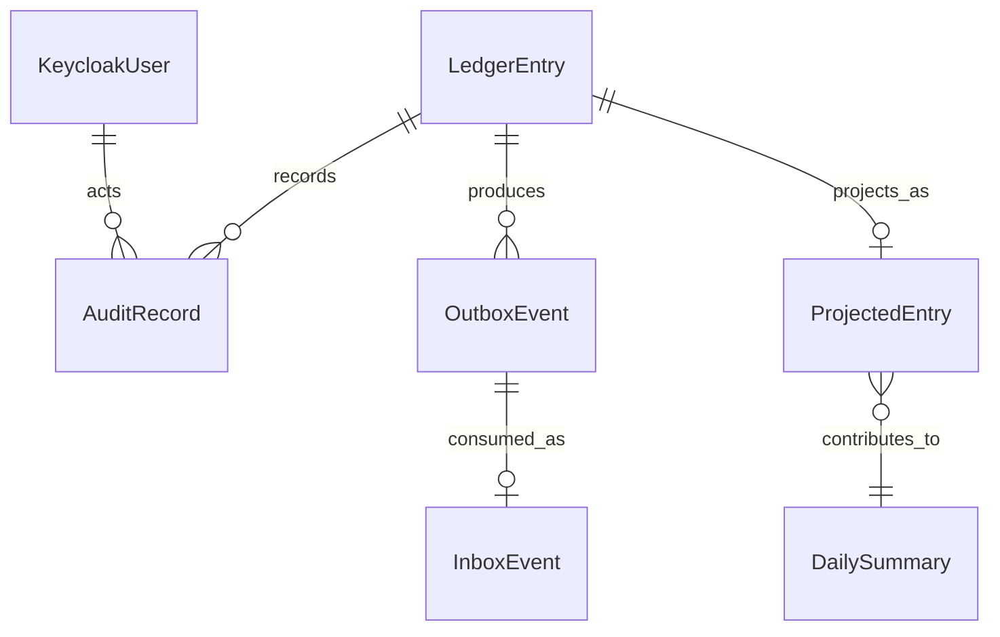

# Fluxo de caixa diário — discovery do teste técnico

> Planejar a execução com **tlc-spec-lean**. As decisões abaixo são o ponto de partida; resultados marcados como *spike* não estão comprovados.

## Situation

- Project: documentação arquitetural, experimentos técnicos e referências de design; o scaffold,
  o `compose.yaml`, as APIs, os testes e o frontend ainda serão criados.
- Decision: entrega do teste comprometida pelo candidato no processo seletivo; forma híbrida escolhida pelo candidato: módulos Ledger e Identity separados dentro de um mesmo processo `Core.Api`, com `Summary.Api` em processo e dados próprios, integrados de forma assíncrona. A separação posterior de Ledger e Identity em dois serviços é evolução futura; a forma com três serviços será comparada, não implementada neste teste. A decisão anterior de permissões iguais para todos os operadores foi substituída por níveis de acesso, tela própria de gestão de usuários e administrador de negócio com acesso total, inclusive à auditoria. A auditoria persistente cobre todas as mudanças de estado de negócio; outbox, inbox e projeção ficam na trilha técnica de eventos e observabilidade. Redefinição de senha também fica para implementação futura.
- In flight: documentação arquitetural, discovery e experimentos técnicos; o scaffold do monorepo ainda será criado e, portanto, não há código de aplicação que comprove os requisitos completos do teste.
- At stake: falhar nos requisitos técnicos obrigatórios descarta o teste. O prazo de entrega informado é 23/09/2026, mas a estimativa de 10 horas não será usada neste momento para limitar a decisão arquitetural.

## Problem

O desafio é de construção: entregar um sistema demonstrável em que um comerciante registre débitos e créditos e consulte o saldo consolidado de cada dia. Sem o controle de lançamentos, não há fonte do fluxo de caixa; sem o consolidado, não há relatório diário. A ordem importa porque o consolidado depende de alterações nos lançamentos, mas a operação de lançar não pode depender da disponibilidade do consolidado. A avaliação mede principalmente a capacidade de justificar a decomposição, o tratamento de falhas e os trade-offs, além de executar a solução.

## Evidence

- 50 requisições por segundo e no máximo 5% de falhas no consolidado: requisito do enunciado. A interpretação acordada é percentual de respostas malsucedidas sob carga contínua de 50 req/s por 5 minutos; latência p95 abaixo de 500 ms é meta adicional escolhida pelo candidato, não exigência textual.
- Até 30 segundos entre uma alteração confirmada em Lançamentos e sua aparição no Consolidado com os componentes saudáveis: meta adicional decidida pelo candidato para ser demonstrável na entrevista; ainda depende de teste e de um indicador confiável de atraso.
- Não existem dados reais de volume de lançamentos, retenção ou frequência de correções. Isso é ausência de informação no enunciado, não evidência de baixo volume; a medição de 50 req/s e o comportamento após falhas precisam ser demonstrados em teste.

## Journey

1. Um usuário se autentica por Keycloak. `admin` pode criar usuários com nome de usuário obrigatório e e-mail opcional, editar nome de exibição e e-mail, atribuir exatamente um papel de negócio (`admin`, `operator` ou `auditor`) e desativar/reativar contas pela tela própria; o nome de usuário é imutável após a criação. Não pode apagar contas definitivamente nem remover/desativar o último `admin` ativo. Após a confirmação de uma desativação, novas requisições da conta são negadas em `Core.Api` e `Summary.Api`, mesmo com token emitido antes da desativação. Uma mudança de papel também passa a valer na requisição seguinte nas duas APIs, inclusive quando remove o papel `admin`, ainda que o token antigo contenha permissões anteriores; requisições já em andamento não são canceladas por essas regras. Na demonstração, a senha inicial de uma conta criada é o nome de usuário seguido de `123` (por exemplo, `bruno123` ou `admin123`), sem troca obrigatória no primeiro acesso. É uma convenção previsível de laboratório, não um controle de segurança nem uma prática aceitável em produção. Redefinição de senha não integra esta entrega. A gestão rotineira prevista passa pela aplicação; o console Keycloak fica para bootstrap e recuperação excepcional, com eventos administrativos capturados na trilha de auditoria. `admin` também pode consultar/criar/editar/excluir logicamente lançamentos e consultar consolidado e auditoria. `operator` pode consultar/criar/editar/excluir logicamente lançamentos e consultar o consolidado, mas não acessa auditoria ou gestão de usuários. `auditor` pode consultar lançamentos, consolidado e auditoria, mas não altera lançamentos nem usuários. Usuário autenticado sem papel de negócio ou com uma combinação ambígua de papéis de negócio não acessa operações de negócio.
2. Ele registra um crédito ou débito em reais, com valor positivo e duas casas decimais, descrição e data opcional. Quando omitida, a data é o dia atual em `America/Sao_Paulo`; quando informada, pode ser hoje ou anterior, mas nunca futura. A mesma restrição vale ao editar a data. A criação aparece na auditoria com operador e horário. Se a resposta se perder e a mesma tentativa for reenviada, o sistema devolve o mesmo lançamento, sem criar outro nem repetir auditoria ou evento; uma nova tentativa intencional pode criar um lançamento de dados idênticos.
3. Ele lista lançamentos ativos. Pode editar data, tipo, valor e descrição; identificador e horário de criação não mudam. Pode excluir logicamente; o item desaparece da listagem normal, mas sua trajetória permanece na auditoria. Não há restauração nesta entrega; esse fluxo fica para implementação futura.
   Se dois usuários editam o mesmo lançamento a partir de versões diferentes, a primeira gravação confirmada prevalece; a segunda recebe conflito, não sobrescreve dados e deve recarregar o registro antes de tentar novamente. A exclusão lógica também exige a versão conhecida pelo cliente: uma alteração concorrente causa conflito e obriga a recarregar antes de confirmar a exclusão.
4. Ele consulta uma data. O relatório mostra total de créditos, total de débitos e saldo do dia (`créditos - débitos`), sem saldo acumulado. Dia sem movimentação retorna os três valores em R$ 0,00.
5. Ao editar um lançamento retroativamente ou mudar sua data, o consolidado anterior é corrigido: o valor sai do dia antigo e entra no novo. A exclusão lógica deixa de contribuir para o cálculo.
6. Com os componentes saudáveis, uma alteração confirmada deve aparecer no Consolidado em até 30 segundos. Se ele estiver indisponível ou atrasado além desse limite, a interface sinaliza isso e não trata saldo antigo como atual. Autenticação já estabelecida, registro, edição, exclusão e consulta de lançamentos continuam utilizáveis. Após a recuperação, mudanças pendentes são processadas até o saldo voltar a corresponder ao estado dos lançamentos; a meta de 30 segundos não se aplica durante a queda.
7. Uma requisição não autenticada, de conta desativada ou sem o papel exigido não consulta nem altera dados. A negação não produz mudança no lançamento, na auditoria, na outbox ou no consolidado. Dados inválidos, como valor zero, negativo, com precisão fora de duas casas ou data futura em `America/Sao_Paulo`, também são rejeitados sem modificar esses registros.
8. Se `Core.Api` ou `Summary.Api` não conseguir confirmar o estado atual da conta e seu papel, nenhuma operação de negócio é executada nessa API: a autorização falha de forma restritiva e a interface informa indisponibilidade da verificação, sem classificar o usuário como comprovadamente sem permissão. Uma queda apenas do Consolidado continua sem bloquear Lançamentos; uma queda do mecanismo necessário à autorização pode bloqueá-los.

## Verdict

Architectural direction committed — see Situation. A escolha da forma assíncrona e dos limites de
escopo foi confirmada pelo candidato; a implementação do teste ainda será criada.

Cheaper paths considered: uma planilha ou produto pronto não demonstraria os serviços C#, os testes e as decisões arquiteturais exigidos; dois serviços lendo diretamente a mesma base seriam mais rápidos, mas não mostrariam propriedade independente dos dados nem recuperação por eventos, objetivo que o candidato escolheu evidenciar.

## Success

- Worked if: outra pessoa consegue executar a solução por Docker, registrar/editar/excluir lançamentos, consultar saldos corretos, observar atualização do saldo em até 30 segundos em operação saudável, derrubar o consolidado sem interromper lançamentos e religá-lo até recuperar o saldo; desativação e troca de papel passam a valer na próxima requisição e, sem confirmação do estado atual de autorização, a operação é bloqueada sem alteração de dados; no teste contínuo de 50 req/s por 5 minutos com a massa de dia concentrado, no máximo 5% das respostas são malsucedidas e a latência p95 da consulta fica abaixo de 500 ms. As massas uniforme e de alterações retroativas/exclusões passam em verificações curtas de correção.
- Early signal: testes de negócio, integração e falha passam antes do frontend ser finalizado; divergência de saldo após replay, erro de auditoria ou publicação perdida sinaliza que a aposta está falhando.
- Review: antes de publicar o repositório para a recrutadora, o candidato executa do zero o README, a demonstração de falha e o teste de carga e registra os resultados reais; números não medidos não serão alegados como atendidos.

## Boundary

In: backend C# híbrido com módulos Ledger e Identity no mesmo processo `Core.Api`, Consolidado em `Summary.Api` separado e com dados próprios, integração assíncrona durável, outbox transacional, auditoria persistente de todas as mudanças de estado de negócio com acesso por papel, tela própria de gestão de usuários e papéis integrada ao Keycloak pelo módulo Identity, administrador de negócio com acesso total, políticas de autorização aplicadas nas APIs, frontend simples em React com Vite seguindo a linguagem visual de [`DESIGN_SYSTEM.md`](../Frontend/DESIGN_SYSTEM.md), Docker Compose, testes e três massas independentes de 10 mil lançamentos distribuídos em 90 dias, carregadas uma de cada vez, documentação no repositório público e observabilidade com OpenTelemetry, Collector e New Relic, incluindo logs distribuídos e `correlation_id`.

Out: múltiplos comerciantes/tenants, saldo acumulado, restauração de lançamento excluído, redefinição de senha, troca obrigatória da senha inicial, separação de Ledger e Identity em serviços próprios, testes aprofundados de replay/reordenação sob múltiplos consumidores e infraestrutura de produção. Essas capacidades são evoluções futuras explícitas, não entregas deste teste. A entrega atual ainda precisa impedir dupla aplicação de um evento, produzir saldo correto após edição/exclusão, atualizar o consolidado em até 30 s em operação saudável e não exibir saldo atrasado como atual. Event Sourcing, HTTPS local com certificados, orquestração e alta disponibilidade de produção também ficam fora do escopo. O Keycloak é a fonte da identidade, mas sua gestão prevista deve ocorrer por tela própria da aplicação e backend autorizado, não apenas pelo console do Keycloak. A demonstração HTTP fica limitada a `localhost` e à rede interna do Compose; em produção, HTTPS/TLS nos pontos expostos e proteção do transporte interno são requisitos arquiteturais, não capacidades implementadas neste teste. O e-mail pessoal da recrutadora e dados pessoais não devem ser publicados no repositório.

## Shape

A forma híbrida escolhida mantém Ledger e Identity como módulos com contratos internos claros, mas no mesmo processo `Core.Api`; apenas o Consolidado é um serviço separado. Lançamentos é a fonte da verdade; o Consolidado mantém uma projeção própria em PostgreSQL, atualizada por eventos do RabbitMQ e recuperável por reprocessamento. A entrega é pelo menos uma vez: publicador confirma aceitação pelo broker e consumidor confirma apenas após persistir a projeção, que deve ser idempotente. Uma única instância PostgreSQL no Compose conterá os bancos lógicos `core_db`, `summary_db` e `keycloak_db`; isso não representa alta disponibilidade nem isolamento físico entre os bancos. O broker único também permanece ponto de falha próprio na demonstração; não se deve descrever Docker Compose como implantação altamente disponível nem prometer exatamente uma vez. A credencial privilegiada para a API administrativa do Keycloak ficará no mesmo processo do Ledger: limitar seus privilégios, proteger o segredo e isolar o módulo Identity no código não equivalem a isolamento de segurança entre processos.

### Adds

- `Core.Api`: processo C# com módulos `Ledger` e `Identity` separados. `Ledger` expõe criação idempotente por identificador de tentativa, listagem, edição e exclusão lógica de lançamentos; `Identity` expõe gestão de usuários e papéis. Ambos validam tokens e papéis do Keycloak; persistem seus dados próprios em áreas separadas de `core_db`, sem duplicar usuários/senhas do Keycloak.
- `LedgerEntry`: `Id`, `BusinessDate`, `Kind`, `Amount`, `Description`, `CreatedAt`, `UpdatedAt`, `DeletedAt`, `Version`; edições e exclusões lógicas exigem a versão conhecida pelo cliente e rejeitam conflito de concorrência sem alteração de estado, auditoria ou outbox.
- `CreationAttempt`: registro de idempotência do módulo Ledger, vinculado ao usuário autenticado e a uma chave de tentativa. A mesma chave com a mesma intenção retorna o resultado original; reutilizar a chave com dados diferentes é conflito. A persistência do resultado ocorre atomicamente com `LedgerEntry`, `AuditRecord` e `OutboxEvent`. Na demonstração, o registro não expira; o plano define o contrato HTTP sem enfraquecer esse comportamento.
- `AuditRecord`: esquema lógico `ResourceType`, `ResourceId`, `ActorId`, `Operation`, `OccurredAt`, `CorrelationId`, `Before`, `After` para mudanças de estado de negócio em lançamentos, usuários, papéis e configurações administráveis. Nunca registra senhas ou tokens. Mudanças em `LedgerEntry` gravam a auditoria na mesma transação; captura de mudanças no Keycloak e topologia do armazenamento administrativo ainda exigem desenho específico. `ActorId` deriva do `sub` autenticado, nunca de um campo enviado pelo cliente.
- `OutboxEvent`: evento da mudança com `EventId`, `EntryId`, `Version`, `CorrelationId`, contexto de rastreamento e estado anterior/novo, gravado na mesma transação de `LedgerEntry` e `AuditRecord`.
- `OutboxPublisher`: componente do módulo Ledger que publica eventos pendentes no RabbitMQ com confirmação de publicação e retry; indisponibilidade do broker não impede a confirmação de um lançamento já gravado.
- `Summary.Api`: API C# de consulta ao consolidado, com `summary_db` PostgreSQL próprio e consumo de eventos; confirma cada entrega ao RabbitMQ somente após persistir inbox e projeção.
- `InboxEvent`, `ProjectedEntry`, `DailySummary`: registros usados para deduplicar eventos, acompanhar a última versão aplicada de cada lançamento e manter os totais diários.
- `web`: aplicação React/Vite a ser criada, com login pelo Keycloak, lançamentos, auditoria, consulta diária e tela de gestão de usuários/papéis para o administrador de negócio (criar, editar nome de exibição/e-mail, atribuir papel, desativar/reativar); apresentará ações conforme o papel, mas as APIs também bloquearão operações não autorizadas, inclusive tentativa de alterar o nome de usuário. Distinguirá saldo atual, atrasado e indisponível. A interface adaptará os tokens e componentes de [`DESIGN_SYSTEM.md`](../Frontend/DESIGN_SYSTEM.md) para um painel de fluxo de caixa: Inter, Geist Mono apenas para dados técnicos, superfícies claras, divisórias finas, cartões de raio 12 px, botões em pílula e verde-menta reservado a ações/estados de destaque. Não copiará heróis de marketing, tabelas de preço, logotipos nem conteúdo da Mintlify.
- Módulo `Identity` de `Core.Api` protegido por papel administrativo e integrado ao Keycloak Admin REST API; o navegador nunca recebe credenciais administrativas da integração, e o Keycloak permanece a única fonte de usuários e papéis. Desativação substitui exclusão definitiva, e a remoção/desativação do último `admin` ativo é rejeitada. A credencial da integração fica restrita ao módulo e ao processo `Core.Api`; não há isolamento entre processos em relação ao Ledger.
- Criação de usuário de demonstração com senha inicial derivada de `username + "123"`, sem persistir essa senha em `core_db`, logs ou auditoria. Não haverá troca obrigatória no primeiro acesso nesta entrega; ela fica para evolução futura. Isso permite inferir a senha de outra conta ao conhecer seu nome de usuário, inclusive de uma conta administrativa, portanto a demonstração não comprova segurança de credenciais para produção.
- Políticas de autorização nos módulos `Ledger` e `Identity` de `Core.Api` e em `Summary.Api`, baseadas em exatamente um dos papéis de negócio `admin`, `operator` ou `auditor` presente no token do Keycloak; zero ou múltiplos desses papéis são negados, sem união de permissões. Testes cobrem acesso permitido, acesso negado e ausência de token em cada superfície.
- Verificação de desativação e papel atual nas duas APIs, inclusive para tokens emitidos antes da mudança. Apenas validar assinatura, expiração e papéis embutidos no JWT não comprova revogação nem alteração de permissão imediata; o mecanismo foi decidido e validado isoladamente no spike de autorização, mas seu impacto nas APIs completas e na meta de 50 req/s ainda precisa ser testado.
- Falha restritiva quando o estado atual de autorização não puder ser confirmado; a resposta deve indicar indisponibilidade temporária da verificação, distinta de uma negação por falta comprovada de permissão. Não persiste mudança de negócio nesse caso.
- `compose.yaml` a ser criado: `web` (React/Vite), `Core.Api`, `Summary.Api`, uma instância PostgreSQL com os bancos lógicos `core_db`, `summary_db` e `keycloak_db`, um RabbitMQ com fila durável e mensagens persistentes, Keycloak em modo de desenvolvimento e OpenTelemetry Collector para execução local. Portas do navegador ficarão publicadas apenas em `127.0.0.1`; bancos e broker permanecerão na rede interna. O realm e contas de demonstração serão importados sem publicar credenciais reais.
- `OpenTelemetry` em ambos os serviços: rastros distribuídos, métricas e logs estruturados para API, outbox, publicação, consumo e projeção. Logs emitidos durante uma atividade incluem `trace_id`/`span_id`; `correlation_id` acompanha a requisição, a auditoria, a outbox, a mensagem e o consumidor. O contexto W3C `traceparent` é propagado separadamente na mensagem. Os serviços enviam OTLP ao Collector; ele exporta ao New Relic usando chave de ingestão fornecida na execução, nunca na imagem nem no Git.
- Métricas de recursos dos containers enviadas pelo Collector ao New Relic; acesso do Collector ao Docker socket, se necessário, fica restrito à demonstração local e deve ser documentado como privilégio sensível.
- Testes automatizados para regras de negócio, auditoria, indisponibilidade/reprocessamento e carga de 50 req/s; README, diagrama e decisões arquiteturais com resultados de teste.

### Changes

- `src/Core.Api` e `src/Summary.Api`: a base atual evolui para os módulos, persistência e integração descritos acima; não são novos serviços adicionais.
- `tests/Core.Api.Tests` e `tests/Summary.Api.Tests`: os testes iniciais separados por projeto evoluem para cobrir os contratos completos.
- `web` e `ops/observability`: serão criados dentro das pastas previstas no scaffold; ainda não há placeholder visual nem configuração do Collector implementados.

### Leaves

- Multi-tenant, saldo acumulado, restauração de lançamento excluído, redefinição de senha, um `Identity.Api` separado, testes aprofundados de replay/reordenação sob múltiplos consumidores, Event Sourcing e infraestrutura de produção ficam fora da implementação escolhida. A restauração, a extração de `Identity.Api` e `Ledger.Api` a partir de `Core.Api` e esses cenários avançados de recuperação são evoluções futuras. A deduplicação mínima e a correção do saldo permanecem nesta entrega.

A alternativa arquitetural a comparar é `Ledger.Api` + `Identity.Api` + `Summary.Api`, três processos e fronteiras de implantação separados. Ela isolaria a credencial administrativa do Keycloak do processo de lançamentos e permitiria ciclos de implantação independentes, mas acrescentaria fronteiras remotas e operação distribuída entre Ledger e Identity. A forma híbrida foi escolhida para implementar; a extração de Ledger e Identity para serviços próprios fica registrada como evolução futura, não como parte desta entrega. Uma base compartilhada com consolidação sob demanda também foi considerada e descartada porque não demonstra a separação de dados nem a recuperação por eventos escolhidas para o teste.

## Roadmap

| Block | Delivers | Clarity |
|---|---|---|
| Módulos Ledger e Identity em `Core.Api` | regras de lançamentos, gestão de usuários, autorização, auditoria e outbox | clear |
| Integração e projeção | publicação durável, deduplicação, aplicação ordenada e recálculo diário | spike |
| APIs, identidade e interface | Keycloak, validação dos tokens em `Core.Api`/`Summary.Api`, efeito imediato de desativação e troca de papel, políticas de papéis e frontend React/Vite baseado em `DESIGN_SYSTEM.md` com gestão de usuários | spike |
| Recuperação, desempenho e entrega | teste de falha, 50 req/s por 5 min com p95 < 500 ms, Docker, README e documentação verificável | spike |
| Segurança e observabilidade | proteção de dados, logs distribuídos, `correlation_id`, sinais OpenTelemetry e métricas de containers visíveis no New Relic | rfc |

## Decisions

| Decision | Choice | Why this | Alternative, and what would make it win | Reversibility |
|---|---|---|---|---|
| Ownership | `Core.Api(Ledger, Identity)` + `core_db`; `Summary.Api` + `summary_db` | queda do Consolidado não interrompe lançamentos; apenas a fronteira exigida pelo caso fica remota | `Ledger.Api` + `Identity.Api` + `Summary.Api` se isolamento de privilégios e implantação independente de Identity predominarem | costly |
| Storage | uma instância PostgreSQL no Compose com `core_db`, `summary_db` e `keycloak_db`; módulos Ledger e Identity mantêm áreas próprias em `core_db` | isola logicamente os dados da projeção e evita acesso por tabelas sem fingir alta disponibilidade | instâncias físicas separadas se houver requisito de produção | costly |
| Mutation | `LedgerEntry.Version` e exclusão por `DeletedAt`; edição ou exclusão com versão desatualizada retorna conflito sem modificar o registro nem gravar auditoria/outbox | correções e exclusões precisam alterar a visão vigente sem apagar a trajetória; ações concorrentes não podem perder alterações silenciosamente | registros imutáveis com lançamentos compensatórios se o negócio vedar edição | costly |
| Creation retry | chave de tentativa por usuário; repetição da mesma tentativa devolve o lançamento original sem nova auditoria/outbox; chave reutilizada com dados diferentes retorna conflito; uma nova chave permite criação intencional de dados idênticos | evita duplicação por timeout ou clique repetido sem proibir movimentações legitimamente iguais | deduplicação pelo conteúdo seria inadequada porque impediria registros distintos com os mesmos valores | reversible |
| Restore deleted entry | não haverá operação de restauração nesta entrega; o registro excluído permanece no histórico de auditoria | mantém a exclusão lógica e seu efeito no consolidado verificáveis sem adicionar outro ciclo de reversão | restauração será evolução futura, com regra própria de autorização, auditoria e atualização da projeção | reversible |
| Audit | `AuditRecord(ResourceType, ResourceId, ActorId, Operation, OccurredAt, CorrelationId, Before, After)` | identifica quem mudou o quê e preserva estados anteriores sem segredos | apenas logs operacionais se não houvesse exigência de histórico consultável | costly |
| Audit scope | todas as mudanças de estado de negócio em `LedgerEntry`, usuários, papéis e configurações administráveis; não duplicar mutações de `OutboxEvent`, `InboxEvent` ou `DailySummary` | histórico compreensível de decisões humanas sem confundir replay técnico com nova alteração de negócio | auditar também tabelas derivadas se houver requisito regulatório explícito de trilha física por tabela | costly |
| Delivery | `LedgerEntry + AuditRecord + OutboxEvent` na mesma transação; publicação posterior | falha do Consolidado ou broker não pode perder uma mudança confirmada | gravação direta no Consolidado somente se acoplamento e indisponibilidade fossem aceitáveis | costly |
| Broker | RabbitMQ único no Compose; fila durável e mensagens persistentes; publisher confirms; ack manual após commit da projeção; entrega pelo menos uma vez | demonstra retry e recuperação sem acoplar a escrita ao Consolidado | cluster/quorum se o teste exigisse HA do broker, ou outro transporte se já existisse plataforma corporativa definida | costly |
| Projection | `InboxEvent` + `ProjectedEntry` + `DailySummary(BusinessDate, Credits, Debits, Balance)` | idempotência e correções retroativas sem somas duplicadas | agregação sob demanda se 50 req/s e isolamento de dados não fossem objetivo | costly |
| Daily result | `Credits`, `Debits`, `Balance = Credits - Debits`, com zero em dia vazio | corresponde ao saldo diário decidido, não ao acumulado | acumulado se o enunciado ou comerciante o exigir | reversible |
| Business date | data omitida usa hoje em `America/Sao_Paulo`; data informada ou editada pode ser hoje ou passada, nunca futura | o fluxo de caixa desta entrega registra movimentações ocorridas, não previsões | datas futuras somente se surgir um fluxo explícito de lançamentos previstos | reversible |
| Authentication | Keycloak em Docker, realm de demonstração com contas iniciais e criação posterior pela tela administrativa; frontend usa OIDC; ambas as APIs validam token; `ActorId` = `sub` | evita implementar emissor de token próprio e vincula auditoria à identidade autenticada | emissor próprio apenas se Keycloak não pudesse integrar-se à execução local | costly |
| User management ownership | tela `web` própria → módulo `Identity` de `Core.Api` → Keycloak Admin REST API; Keycloak é fonte de usuários e papéis; nenhuma credencial administrativa no navegador | permite experiência própria sem duplicar identidade; segredo privilegiado fica no processo Core, com escopo mínimo e módulo separado | `Identity.Api` próprio se o isolamento do segredo do processo Ledger for exigido | costly |
| Keycloak administration boundary | gestão rotineira pela tela própria; console Keycloak só para bootstrap/recuperação excepcional; eventos administrativos excepcionais entram na auditoria | evita alterações silenciosas fora da aplicação e mantém caminho de recuperação | operação cotidiana no console apenas se a tela própria não fosse requisito | costly |
| Role matrix | `admin`: lançamentos R/W, consolidado R, auditoria R, usuários/papéis R/W; `operator`: lançamentos R/W, consolidado R; `auditor`: lançamentos R, consolidado R, auditoria R; demais negados | demonstra autorização efetiva e separa operação, auditoria e administração | papéis adicionais se houver novas responsabilidades de negócio | costly |
| Role cardinality | exatamente um papel de negócio por usuário entre `admin`, `operator` e `auditor`; zero ou múltiplos no token negam acesso às APIs de negócio | impede combinação implícita de privilégios e torna a matriz de acesso inequívoca | múltiplos papéis apenas com regra explícita de composição de permissões | reversible |
| User lifecycle | `admin`: criar, editar, atribuir papel, desativar/reativar; sem redefinição de senha nem exclusão definitiva; último `admin` ativo não pode ser desativado nem perder o papel | preserva referência dos autores na auditoria e evita bloqueio administrativo; redefinição de senha é evolução futura | exclusão definitiva apenas se exigida por política de retenção/privacidade específica | costly |
| Deactivation effect | após confirmação da desativação, toda nova requisição da conta é negada em `Core.Api` e `Summary.Api`, mesmo com token antigo; não cancela requisição já em andamento | desativar uma conta deve efetivamente interromper seu acesso, não apenas impedir novo login | aceitar acesso até expiração do token somente se o requisito de revogação imediata for relaxado | costly |
| Role change effect | após confirmação da mudança, a próxima requisição usa o papel novo em `Core.Api` e `Summary.Api`, mesmo com token antigo; não cancela requisição já em andamento | impede que um usuário continue com privilégios removidos e evita que a tela e as APIs discordem sobre seu papel | aplicar mudanças só na renovação do token apenas se o requisito de efeito imediato for relaxado | costly |
| Authorization outage | se o estado atual da conta/papel não puder ser confirmado, `Core.Api` e `Summary.Api` bloqueiam operações de negócio e sinalizam indisponibilidade da verificação, sem dizer que o usuário perdeu permissão | evita aceitar privilégios potencialmente revogados | aceitar temporariamente claims do token apenas se o requisito de efeito imediato for relaxado | costly |
| User fields | nome de usuário obrigatório e imutável após criação; e-mail opcional; `admin` pode alterar nome de exibição e e-mail | não há convite ou redefinição por e-mail nesta entrega; mantém estável o login relacionado à senha inicial e facilita interpretar o histórico, enquanto a auditoria usa o `sub` do Keycloak | tornar e-mail obrigatório quando houver fluxos que dependam de comunicação com o usuário | reversible |
| Initial password | em contas criadas para a demonstração local, `username + "123"` (por exemplo, `bruno123`), sem troca obrigatória no primeiro acesso; nunca publicar como política de produção | regra explícita escolhida para facilitar o acesso inicial ao teste; sua previsibilidade permite tentativa de acesso a outra conta, inclusive administrativa | convite ou segredo temporário aleatório e troca obrigatória em uma implantação real | reversible |
| Local transport | HTTP apenas em `127.0.0.1` e rede interna do Compose; HTTPS/TLS documentado para implantação real | evita certificados locais na demonstração sem alegar segurança de transporte de produção | HTTPS local se a execução do teste exigisse comprovação de criptografia em trânsito | reversible |
| Frontend | React com Vite no componente `web`; backend e políticas de acesso permanecem autoridade das regras | escolha explícita do candidato para a interface simples de acompanhamento e administração | outra tecnologia de interface somente se houver restrição técnica demonstrada | reversible |
| Frontend visual language | `DESIGN_SYSTEM.md` na raiz: Inter para UI, Geist Mono para dados técnicos, branco/preto como base, `#00d4a4` para destaque, cartões de 12 px e botões em pílula; adaptar para telas de fluxo de caixa sem copiar páginas/branding Mintlify | referência visual anexada pelo candidato e instalada pelo comando solicitado; cria consistência sem adicionar fluxos de marketing ao produto | identidade visual própria futura se o teste exigir marca bancária específica | reversible |
| Demo packaging | `compose.yaml`; `web` React/Vite e serviços de backend; sem orquestrador de produção | execução reproduzível e foco no desafio | orquestração se houver requisito operacional de produção | reversible |
| Observability | OpenTelemetry nas APIs e consumidores → Collector em Docker → New Relic; métricas de containers pelo Collector | correlaciona comportamento da aplicação e recursos sem acoplar o serviço ao destino externo | exportação direta se não houvesse necessidade de processar e centralizar a telemetria | reversible |
| Log correlation | `traceparent` W3C + `CorrelationId` em HTTP, `AuditRecord`, `OutboxEvent` e mensagem; logs com `trace_id`, `span_id`, `correlation_id`, `service.name`, operação e resultado | a operação permanece pesquisável durante fila, retry e replay, mesmo quando a execução assíncrona não é contínua | somente `trace_id` se não existisse persistência/replay assíncrono | costly |
| Load target | `GET daily-summary`: 50 req/s contínuos por 5 min sobre a massa de dia concentrado; falhas ≤ 5%; p95 < 500 ms. Verificações curtas nas outras massas | torna mensurável o requisito de pico sem três execuções longas na máquina local | três rodadas completas se houver necessidade de comparar desempenho dos três perfis | reversible |
| Load data | 3 massas independentes de 10.000 lançamentos em 90 dias, carregadas uma de cada vez: uniforme, dia concentrado, alterações retroativas/exclusões | cobre perfis distintos sem manter 30.000 registros simultaneamente na máquina local | uma massa única se o ambiente local não comportar a preparação dos três cenários | reversible |
| Freshness target | alteração confirmada → saldo correspondente em até 30 s com componentes saudáveis; acima disso, status `desatualizado` | dá limite observável para a consistência eventual e uma transição demonstrável na entrevista | limite maior se houver evidência de carga incompatível ou exigência de negócio diferente | reversible |

## Needs an RFC

1. Gestão e segurança restantes: papéis, operações da tela, proteção do último administrador, escopo da auditoria de negócio e a fórmula da senha inicial de demonstração estão decididos; faltam armazenamento/captura de mudanças administrativas no Keycloak, privilégio mínimo e proteção da credencial no processo `Core.Api` e tratamento de informações sensíveis. Redefinição e troca obrigatória da senha inicial foram excluídas desta entrega; a senha previsível permanece válida e enfraquece a segurança demonstrada pelo controle de acesso. A decisão híbrida aceita que a credencial administrativa não esteja isolada em outro processo; separar Ledger e Identity em serviços próprios fica para evolução futura. A execução em HTTP local não comprova criptografia em trânsito; a documentação de produção precisa indicar HTTPS/TLS.
2. Contrato operacional restante: definir o marcador verificável de `atual`/`desatualizado`. A rodada completa de carga usa a massa de dia concentrado; as outras duas recebem verificações curtas. O limite de 30 s de atualização saudável e as metas de carga já estão decididos, mas ainda não foram medidos.
3. Governança da telemetria: Collector e New Relic estão decididos; faltam política de amostragem, retenção/custo, atributos permitidos, alarmes e como evidenciar perda de telemetria. Não registrar valores financeiros, tokens, senhas nem chave do New Relic em logs, spans ou no repositório; a indisponibilidade da telemetria não derruba os serviços de negócio.

## Needs a spike

1. Consistência mínima do Consolidado: não exige spike separado antes do plano; entra como teste da implementação. Um consumidor serial, inbox e versão aplicada devem impedir dupla contribuição de um evento, manter o saldo correto após edição/exclusão e recuperar pendências depois de uma queda do Consolidado. Testes aprofundados de reordenação, replay arbitrário e múltiplos consumidores ficam como evolução futura; não se deve alegar que foram comprovados nesta entrega.
2. Frescor do consolidado: não exige spike separado antes do plano; o marcador de `atual`/`desatualizado` e a prova de atualização em até 30 s entram como tarefas de implementação. Com consumidor parado, a interface não deve chamar um saldo antigo de atual. Um protocolo de reconciliação mais sofisticado e sua prova sob falhas prolongadas ficam para evolução futura; sem marcador confiável na implementação, nunca rotular o saldo como atual sem confirmação.
3. Carga: executar 50 req/s por 5 minutos no endpoint de consolidado usando a massa de dia concentrado e medir respostas malsucedidas e p95; fazer verificações curtas de correção nas massas uniforme e de alterações. Encerrar com relatório reproduzível e características da máquina; se falhas excederem 5% ou p95 atingir 500 ms, diagnosticar consulta, índice e capacidade antes de alegar atendimento.
4. Identidade no Compose: provar o fluxo de login do navegador e validação nas duas APIs usando o mesmo emissor Keycloak acessível do host e da rede Docker. Encerrar quando tokens válidos funcionarem nas duas APIs e tokens expirados, com emissor ou destinatário incorreto forem rejeitados; ajustar apenas a configuração local do emissor, sem desabilitar validações para fazer o teste passar.
5. Auditoria administrativa: provar que criação, edição, mudança de papel e desativação feitas pela tela produzem histórico persistente sem senhas/tokens e que mudanças excepcionais feitas diretamente no Keycloak entram na auditoria via eventos administrativos. Encerrar com teste de alteração via console ou API administrativa fora da aplicação, confirmando a presença do evento sem afirmar estado anterior/novo quando a fonte não o fornece.
6. Estado atual de acesso: **decidido e validado isoladamente pelo spike** em [`SPIKE-001-AUTORIZACAO-IMEDIATA.md`](../Spikes/SPIKE-001-AUTORIZACAO-IMEDIATA/SPIKE-001-AUTORIZACAO-IMEDIATA.md). Após validação local completa do JWT, cada requisição de negócio em `Core.Api` e `Summary.Api` lê online no Keycloak o usuário identificado pelo `sub` e seus papéis efetivos; `enabled=false`, usuário ausente ou zero/múltiplos papéis de negócio são `403` comprovado, e falha de consulta é `503` restritivo sem mutação. O experimento real com Keycloak 26.7.4 confirmou desativação e troca de papel com o mesmo JWT antigo nos dois leitores lógicos, permissões de leitura da service account e 500 verificações em 10 s a 50/s sem falha (p95 253,0 ms). Introspecção sozinha e estado local propagado foram rejeitados para esta entrega, pois não provam o papel atual na requisição seguinte. A implementação continua pendente de testes Compose nas APIs reais, da prova de ausência de mutação e da carga de 50 req/s por 5 min; o spike não permite alegar esse requisito do produto como atendido.

## Sources

- [DESIGN_SYSTEM.md](../Frontend/DESIGN_SYSTEM.md) — guia oficial de tokens, componentes e linguagem visual do frontend.
- [apoio/descricao_teste.md](../apoio/descricao_teste.md) — requisitos obrigatórios, cenário de falha e 50 req/s.
- [apoio/descricao_vaga.txt](../apoio/descricao_vaga.txt) — ênfase em decisões arquiteturais, integração, segurança, qualidade e documentação.
- [apoio/email_recrutadora.md](../apoio/email_recrutadora.md) — e-mail da recrutadora de 14/09/2026 (cópia local, não publicar), com data de entrega e pontos de avaliação.
- Conversa de discovery de 17/09/2026 — regras de negócio, escolha explícita da forma assíncrona e pedido posterior de OpenTelemetry com New Relic; as 10 horas informadas não limitam a decisão arquitetural nesta etapa.
- [OpenTelemetry .NET instrumentation](https://opentelemetry.io/docs/languages/dotnet/instrumentation/) — suporte a rastros, métricas e logs em aplicações .NET.
- [New Relic OTLP](https://docs.newrelic.com/docs/opentelemetry/best-practices/opentelemetry-otlp/) e [OpenTelemetry Collector](https://docs.newrelic.com/docs/opentelemetry/get-started/collector-processing/opentelemetry-collector-processing-intro/) — ingestão OTLP e opção de pipeline por Collector.
- [Keycloak em Docker](https://www.keycloak.org/getting-started/getting-started-docker), [importação de realm](https://www.keycloak.org/server/containers) e [JWT bearer no ASP.NET Core](https://learn.microsoft.com/en-us/aspnet/core/security/authentication/configure-jwt-bearer-authentication) — identidade externa e validação nas APIs; `start-dev` é apenas para desenvolvimento.
- [Correlação de logs em OpenTelemetry .NET](https://opentelemetry.io/docs/languages/dotnet/logs/correlation/), [propagação de contexto](https://opentelemetry.io/docs/concepts/context-propagation/) e [mensageria](https://opentelemetry.io/docs/specs/semconv/messaging/messaging-spans/) — `trace_id`/`span_id` em logs e contexto através de serviços e mensagens.
- [Métricas de containers Docker no New Relic](https://docs.newrelic.com/docs/opentelemetry/integrations/docker-monitoring/self-hosted/) — observação de recursos de container distinta da instrumentação da aplicação.
- [RabbitMQ: publisher confirms e consumer acknowledgements](https://www.rabbitmq.com/docs/confirms) — confirmação em lados distintos da entrega, sem promessa de processamento exatamente uma vez.
- [Administração de usuários e papéis no Keycloak](https://www.keycloak.org/docs/latest/server_admin/) e [autorização por políticas no ASP.NET Core](https://learn.microsoft.com/en-us/aspnet/core/security/authorization/policies) — papéis no token e controle efetivo nas APIs.
- [Keycloak Admin REST API](https://www.keycloak.org/docs-api/latest/rest-api/) — integração administrativa do backend, sem credencial administrativa no navegador.
- [Gestão de sessões e revogação no Keycloak](https://www.keycloak.org/docs/latest/server_admin/) — encerrar sessão não revoga necessariamente access tokens já emitidos; a garantia de bloqueio imediato precisa ser demonstrada nas APIs.
- [Eventos administrativos do Keycloak](https://www.keycloak.org/docs/latest/server_admin/) — ações via console ou Admin REST podem gerar eventos para trilha de mudanças fora da tela própria.
- [SPIKE-001-AUTORIZACAO-IMEDIATA](../Spikes/SPIKE-001-AUTORIZACAO-IMEDIATA/SPIKE-001-AUTORIZACAO-IMEDIATA.md) — mecanismo recomendado, fontes primárias verificadas, trade-offs, testes e riscos residuais para o efeito na próxima requisição com JWT antigo.
