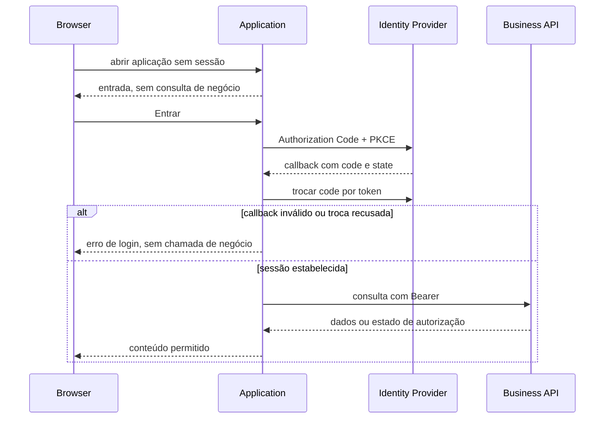

# Entrada e proteção da aplicação

> Plano a partir deste documento. Cada slice abaixo carrega seu próprio formato — copie-o, não o rederive.
> Status: confirmed by user, 2026-09-20

## Situation

- Project: em construção ativa, com frontend React/Vite, Keycloak local e APIs já protegidas.
- Decision: comprometida pelo usuário em 2026-09-20: criar uma entrada própria para login e impedir qualquer acesso sem autenticação, preservando `admin`, `operator` e `auditor`.
- In flight: o OIDC Authorization Code + PKCE, o callback, o armazenamento da sessão somente em memória e a autorização efetiva das APIs já existem; redefinição de senha, identidade própria e mudança da matriz de papéis ficam fora deste trabalho.
- At stake: deixar uma rota ou estado de negócio acessível sem sessão expõe dados e contradiz o requisito central de segurança da aplicação.

## Problem

Este é um problema de construção: a aplicação já sabe autenticar pelo Keycloak, mas hoje uma visita sem sessão inicia o redirecionamento automaticamente e não oferece uma entrada própria nem uma saída explícita. Isso deixa a jornada incompleta para quem chega, cancela o login, perde a sessão ou não possui papel de negócio. O número de incidentes reais não é medido; a evidência disponível é o código e os testes existentes, que cobrem o protocolo, mas não a tela de entrada e a jornada completa de acesso negado.

## Success

- Worked if: uma pessoa sem sessão vê somente a entrada, inicia o login pelo botão, chega ao conteúdo apenas após callback válido, pode sair, e cada papel vê somente as operações previstas na matriz existente.
- Going wrong: qualquer conteúdo de negócio aparece antes da autenticação, um papel inválido entra, ou uma sessão expirada mantém operações utilizáveis.
- Review: após os testes de frontend e uma jornada Playwright para cada papel e para usuário não autenticado.

## Boundary

In: tela de entrada, estados de carregamento/erro, início e conclusão OIDC, logout, sessão expirada, bloqueio da aplicação sem sessão e visibilidade/navegação por papel.

Out: formulário próprio de usuário e senha; redefinição de senha; alteração da matriz de permissões; alteração do mecanismo de autorização online das APIs; persistência de tokens no navegador.

Unchanged: `admin`, `operator`, `auditor`; `Core.Api`; `Summary.Api`; contratos de negócio; Keycloak como emissor e fonte de identidade.

## Prior art

- OIDC Authorization Code + PKCE com `state` e verifier — manter, porque já é o contrato de autenticação testado.
- APIs negam token ausente ou inválido, papel insuficiente e indisponibilidade do verificador com resultados distintos — preservar a distinção no frontend.
- O frontend já oculta Auditoria para `operator` e Usuários para qualquer papel diferente de `admin` — transformar a visibilidade em proteção de navegação, sem tratá-la como autoridade de segurança.

## Shape

A aplicação terá uma entrada própria, com ação explícita para iniciar OIDC, e nenhum conteúdo de negócio será renderizado enquanto a sessão não estiver autenticada. A sessão continuará apenas em memória; logout limpa a sessão local e, quando houver endpoint de encerramento OIDC disponível, encerra também a sessão do provedor. A autorização de negócio continua pertencendo às APIs, enquanto o frontend usa o papel conhecido apenas para orientar navegação e mensagens. Uma alternativa mais pesada seria persistir sessão e criar um backend-for-frontend; ela só venceria se houvesse requisito de sobrevivência a recarregamento ou isolamento adicional de tokens, inexistente neste escopo.

## Key decisions

1. **A entrada da aplicação não terá formulário próprio de senha; o botão inicia OIDC Authorization Code + PKCE.** Isso mantém o segredo no provedor já adotado e evita criar um segundo sistema de identidade.
2. **Sem sessão autenticada, somente a entrada, o carregamento ou o erro de autenticação podem ser renderizados.** Nenhum dado, ação ou rota de negócio será acessível por estado visual.
3. **A sessão permanece somente em memória e é apagada no logout, erro de autorização ou expiração.** Não haverá armazenamento persistente de access token no navegador nesta entrega.
4. **As APIs permanecem a autoridade final para os níveis de acesso.** O frontend pode esconder navegação, mas não concede permissão; `admin`, `operator` e `auditor` continuam com a matriz já definida.
5. **Conta sem exatamente um papel de negócio é tratada como não autorizada.** A aplicação não deve escolher um papel por conveniência nem compor privilégios ambiguamente.
6. **Falha de verificação atual é apresentada como indisponibilidade, não como falta de permissão.** `403` e `503` devem conservar significados diferentes para a pessoa e para os testes.

## Work

| Slice | Delivers | Status |
|---|---|---|
| [Auth](#auth) | entrada, callback, sessão protegida, logout e estados de erro | clear |
| [Role access](#role-access) | navegação e operações compatíveis com os três papéis, com negação segura | clear |

Order: Auth → Role access.

Already handled by existing code: validação JWT e autorização online nas APIs → middleware e testes de integração existentes; fluxo criptográfico PKCE e callback → cliente OIDC existente.

Derivable from the repository, left to the plan: nomenclatura visual, espaçamento, componentes e mensagens gerais — seguir o design system e os padrões já presentes no frontend.

### Auth

**Delivers** uma entrada explícita e um limite de autenticação que impede o dashboard de existir sem sessão. **Status: clear.**

| State | What should happen | Caller sees |
|---|---|---|
| Primeira visita sem sessão | não consultar APIs de negócio; aguardar ação de entrada | tela de login com botão “Entrar” |
| Login iniciado | gerar e guardar estado transitório e redirecionar ao provedor | indicação de carregamento |
| Callback válido | trocar código por token, estabelecer sessão em memória e mostrar a aplicação | dashboard correspondente ao papel |
| Callback cancelado ou inválido | não consultar APIs de negócio; limpar tentativa pendente | erro de login e ação para tentar novamente |
| Logout | limpar sessão local e encerrar sessão OIDC quando suportado | tela de login |
| Sessão expirada ou `401` | descartar sessão e impedir novas operações | mensagem de sessão expirada e nova entrada |
| `503` na autorização atual | manter a distinção entre indisponibilidade e negação | indisponibilidade temporária, sem mutação |

`GET /.well-known/openid-configuration` `—` → endpoints OIDC do provedor

Flow:

Alternatives considered: login automático na primeira visita — vence somente se a experiência não exigir uma entrada explícita; foi rejeitado porque o requisito confirmado pede uma tela de login própria.

### Role access

**Delivers** uma matriz visível e navegável sem conceder autoridade fora das APIs. **Status: clear.**

| State | What should happen | Caller sees |
|---|---|---|
| `admin` autenticado | permitir lançamentos, consolidado, auditoria e usuários | Visão geral, Auditoria e Usuários |
| `operator` autenticado | permitir lançamentos e consolidado; esconder e bloquear auditoria/usuários | Visão geral |
| `auditor` autenticado | permitir leitura de lançamentos, consolidado e auditoria; bloquear mutações e usuários | Visão geral e Auditoria |
| sem papel ou com papéis ambíguos | não carregar negócio e não permitir contornar a navegação | acesso não autorizado |
| tentativa direta em área restrita | recusar sem mutação e retornar à área permitida | mensagem de acesso não autorizado |

`GET /ledger/entries` `Bearer` → `200` lançamentos ou `401`/`403`/`503`

`POST /ledger/entries` `Bearer` → `201` lançamento ou `401`/`403`/`503`

`GET /audit` `Bearer` → `200` auditoria ou `401`/`403`/`503`

`GET /identity/users` `Bearer` → `200` usuários ou `401`/`403`/`503`

Alternatives considered: confiar somente na ocultação de botões — vence apenas para um protótipo sem dados; foi rejeitado porque qualquer cliente pode chamar as APIs diretamente.

## Sources

- [DISCOVERY-001-FLUXO-CAIXA.md](DISCOVERY-001-FLUXO-CAIXA.md) — matriz de papéis, OIDC, sessão em memória e limites de identidade.
- [SPIKE-001-AUTORIZACAO-IMEDIATA.md](../Spikes/SPIKE-001-AUTORIZACAO-IMEDIATA/SPIKE-001-AUTORIZACAO-IMEDIATA.md) — efeito imediato de desativação/troca de papel e distinção `403`/`503`.
- `front/ARCHITECTURE.md` — organização e limites do frontend.
