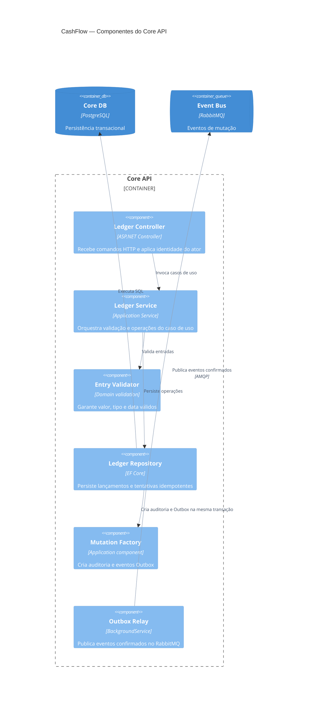

# C4 nível 3 — componentes do Core API

```mermaid
C4Component
    title CashFlow — Componentes do Core API

    Container_Boundary(coreApi, "Core API") {
        Component(controller, "Ledger Controller", "ASP.NET Controller", "Recebe comandos HTTP e aplica identidade do ator")
        Component(service, "Ledger Service", "Application Service", "Orquestra validação e operações do caso de uso")
        Component(validator, "Entry Validator", "Domain validation", "Garante valor, tipo e data válidos")
        Component(repository, "Ledger Repository", "EF Core", "Persiste lançamentos e tentativas idempotentes")
        Component(mutationFactory, "Mutation Factory", "Application component", "Cria auditoria e eventos Outbox")
        Component(relay, "Outbox Relay", "BackgroundService", "Publica eventos confirmados no RabbitMQ")
    }

    ContainerDb(coreDb, "Core DB", "PostgreSQL", "Persistência transacional")
    ContainerQueue(rabbit, "Event Bus", "RabbitMQ", "Eventos de mutação")

    Rel(controller, service, "Invoca casos de uso")
    Rel(service, validator, "Valida entradas")
    Rel(service, repository, "Persiste operações")
    Rel(repository, mutationFactory, "Cria auditoria e Outbox na mesma transação")
    Rel(repository, coreDb, "Executa SQL")
    Rel(relay, rabbit, "Publica eventos confirmados", "AMQP")

    UpdateRelStyle(controller, service, $textColor="#475569", $lineColor="#94a3b8")
    UpdateRelStyle(service, validator, $textColor="#475569", $lineColor="#94a3b8")
    UpdateRelStyle(service, repository, $textColor="#475569", $lineColor="#94a3b8")
    UpdateRelStyle(repository, mutationFactory, $textColor="#475569", $lineColor="#94a3b8")
    UpdateRelStyle(repository, coreDb, $textColor="#475569", $lineColor="#94a3b8")
    UpdateRelStyle(relay, rabbit, $textColor="#475569", $lineColor="#94a3b8")
    UpdateLayoutConfig($c4ShapeInRow="3", $c4BoundaryInRow="1")
```

