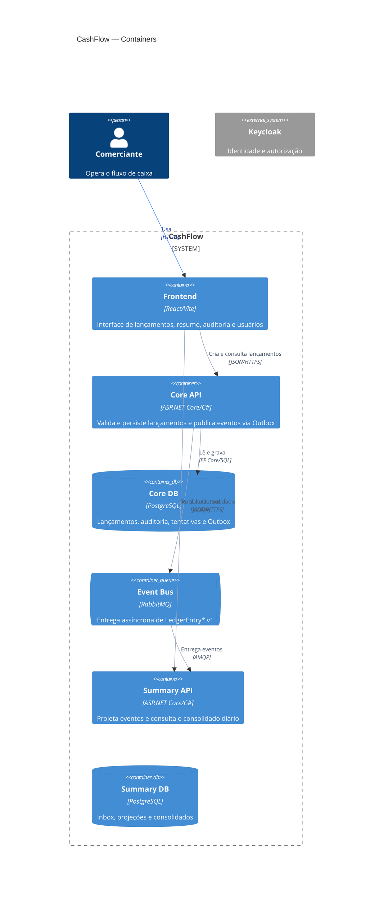

# C4 nível 2 — containers

```mermaid
C4Container
    title CashFlow — Containers

    Person(operator, "Comerciante", "Opera o fluxo de caixa")

    System_Boundary(cashFlow, "CashFlow") {
        Container(frontend, "Frontend", "React/Vite", "Interface de lançamentos, resumo, auditoria e usuários")
        Container(coreApi, "Core API", "ASP.NET Core/C#", "Valida e persiste lançamentos e publica eventos via Outbox")
        ContainerDb(coreDb, "Core DB", "PostgreSQL", "Lançamentos, auditoria, tentativas e Outbox")
        ContainerQueue(rabbit, "Event Bus", "RabbitMQ", "Entrega assíncrona de LedgerEntry*.v1")
        Container(summaryApi, "Summary API", "ASP.NET Core/C#", "Projeta eventos e consulta o consolidado diário")
        ContainerDb(summaryDb, "Summary DB", "PostgreSQL", "Inbox, projeções e consolidados")
    }

    System_Ext(keycloak, "Keycloak", "Identidade e autorização")

    Rel(operator, frontend, "Usa", "HTTPS")
    Rel(frontend, coreApi, "Cria e consulta lançamentos", "JSON/HTTPS")
    Rel(frontend, summaryApi, "Consulta consolidado", "JSON/HTTPS")
    Rel(coreApi, coreDb, "Lê e grava", "EF Core/SQL")
    Rel(coreApi, rabbit, "Publica Outbox", "AMQP")
    Rel(rabbit, summaryApi, "Entrega eventos", "AMQP")

    UpdateRelStyle(operator, frontend, $textColor="#1e40af", $lineColor="#3b82f6")
    UpdateRelStyle(frontend, coreApi, $textColor="#475569", $lineColor="#94a3b8")
    UpdateRelStyle(frontend, summaryApi, $textColor="#475569", $lineColor="#94a3b8")
    UpdateRelStyle(coreApi, coreDb, $textColor="#475569", $lineColor="#94a3b8")
    UpdateRelStyle(coreApi, rabbit, $textColor="#475569", $lineColor="#94a3b8")
    UpdateRelStyle(rabbit, summaryApi, $textColor="#475569", $lineColor="#94a3b8")
    UpdateLayoutConfig($c4ShapeInRow="3", $c4BoundaryInRow="1")
```

O Summary não participa da transação de criação. Se ele estiver indisponível, o Core grava o lançamento e o Outbox permanece pendente até a recuperação.

