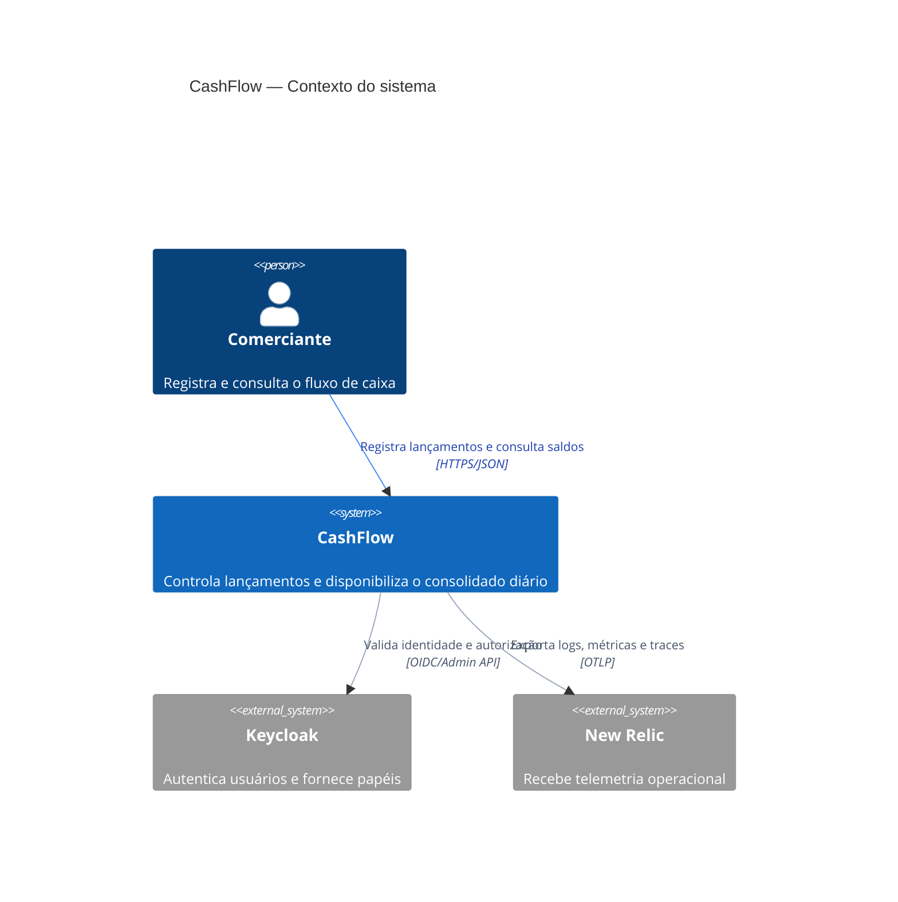

# C4 nível 1 — contexto do sistema

```mermaid
C4Context
    title CashFlow — Contexto do sistema

    Person(operator, "Comerciante", "Registra e consulta o fluxo de caixa")
    System(cashFlow, "CashFlow", "Controla lançamentos e disponibiliza o consolidado diário")
    System_Ext(keycloak, "Keycloak", "Autentica usuários e fornece papéis")
    System_Ext(newRelic, "New Relic", "Recebe telemetria operacional")

    Rel(operator, cashFlow, "Registra lançamentos e consulta saldos", "HTTPS/JSON")
    Rel(cashFlow, keycloak, "Valida identidade e autorização", "OIDC/Admin API")
    Rel(cashFlow, newRelic, "Exporta logs, métricas e traces", "OTLP")

    UpdateRelStyle(operator, cashFlow, $textColor="#1e40af", $lineColor="#3b82f6")
    UpdateRelStyle(cashFlow, keycloak, $textColor="#475569", $lineColor="#94a3b8")
    UpdateRelStyle(cashFlow, newRelic, $textColor="#475569", $lineColor="#94a3b8")
    UpdateLayoutConfig($c4ShapeInRow="3", $c4BoundaryInRow="1")
```

